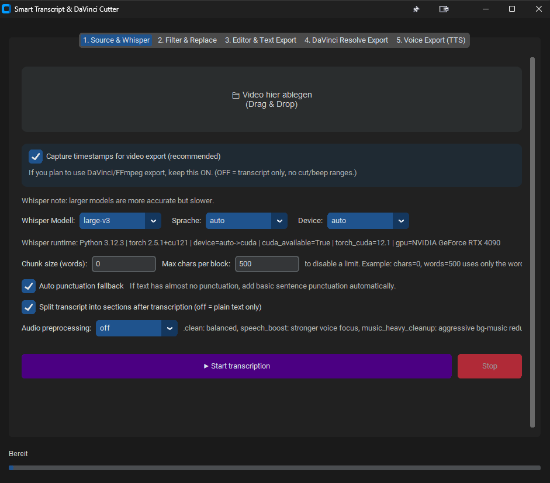

# Smart Transcript & DaVinci Cutter

Desktop app for:
- Whisper transcription
- text filtering/replacement
- text export/translation
- DaVinci Resolve export (cut timeline/render)
- FFmpeg export (silence/beep replacement)

## UI



## Files in this folder

- `transcript.py` - main app
- `requirements.txt` - Python dependencies
- `LICENSE` - GNU GPL v3

## Install

```bash
python -m venv .venv
.venv\Scripts\activate
pip install -r requirements.txt
python transcript.py
```

Windows quick setup:

- Run `install.bat`
  - choose mode: `System Python`, `Python venv`, or `Conda env`
  - `System Python`: no virtual environment, installs directly into current Python
  - `Python venv`: picks highest compatible Python automatically (3.11 -> 3.10 -> 3.9)
  - `Conda env`: shows available conda envs; you can select one or create a new one
  - stores your choice for `start_gui.bat`
- Run `start_gui.bat` to start the app

## Separate TTS repo

The TTS variant (with Tab 5) is split into a separate repository/workspace:

- `c:\VideoTools\Transcript_multi_tool_tts`

### Build on Windows with batch scripts

Run these files in this folder:

- `build_onefile.bat` -> creates `dist\transcript.exe`
- `build_onedir.bat` -> creates `dist\transcript\`

Why both options:

- `onefile`: single EXE, easiest to share/download
- `onedir`: usually more stable for large ML stacks and often faster startup

## Notes

- FFmpeg/ffprobe should be available in `PATH`.
- DaVinci Resolve API export requires Resolve running with an open project.
- Optional: set a custom `DaVinciResolveScript.py` path in Tab 4 if auto-import fails.
- CUDA is optional. If unavailable, app falls back to CPU.

## Build as EXE (PyInstaller)

Example (PowerShell):

```bash
pip install pyinstaller
pyinstaller --onefile --noconsole transcript.py
```

For large ML dependencies, `--onedir` is often more stable and starts faster than `--onefile`.

Both batch scripts include:
- `--collect-all tkinterdnd2`
- `--collect-all customtkinter`
- `--collect-data whisper`
- `--collect-submodules whisper`

This avoids common EXE runtime issues like missing `whisper/assets/mel_filters.npz`.

